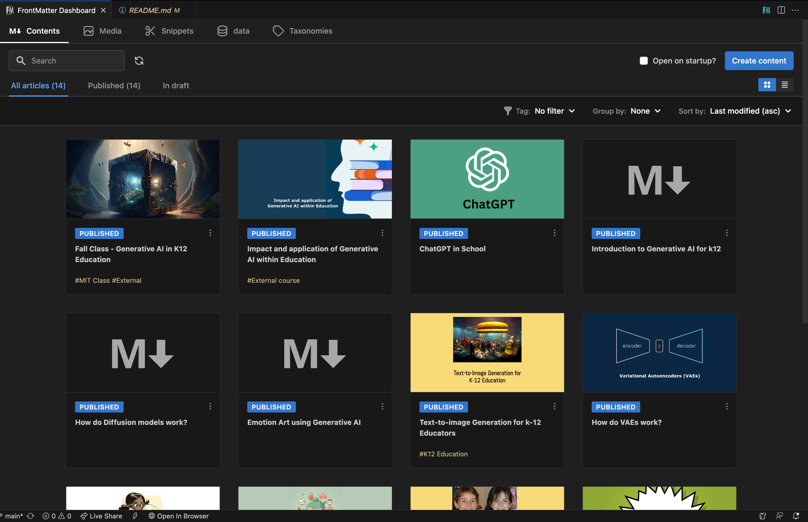

# GenAI Lab

This is the repo for a generative AI literacy website.
It was built with a few goals in mind:

- Responsive design: the website looks and behaves well on screens of all sizes;
- Fast: it only loads what's needed for it to work;
- Adaptive: it supports dark mode from most operating systems by default (desktop and mobile);
- Pretty: have a pleasant design that is both accessible and pleasing to the eye.

This was achieved with the help of SvelteKit. There is almost no JavaScript running, and it actually works with JS disabled! While JS is awesome, it's important to know when it's not needed.

## Building & Running Locally

1. Clone this repo

```bash
git clone https://github.com/mitmedialab/GenAI-Lab.git
```

2. Install dependencies

```bash
npm install
```

4. Run local server

```bash
npm run dev
```

The site should now be available at http://localhost:5173/ on your local machine, and your local machine's IP address on your network—great for testing on mobile OSes.

# Live site

You can see the website live [here](https://gen-ai-lab-sage.vercel.app/).

# Project Structure

This project follows the basic [SvelteKit structure](https://kit.svelte.dev/docs/project-structure), with some added conventions to make customization a post-management easier.

## Components

The components are organized following the [Atomic Design](https://medium.com/@WeAreMobile1st/atomic-design-getting-started-916bc81bad0e) principles, albeit somewhat simplified. Components are in the `src/lib/components` folder, and are organized in the following way:

### Atoms

Atoms are the most basic components, which can be seen as building blocks for other components. They're small and self-contained, and do only one thing. Examples of atoms are buttons, inputs, and tags.

### Molecules

Molecules are groups of atoms that work together to form a more complex component. Examples of molecules are cards, groups of links, or an alert callout.

### Organisms

Organisms, in this project, are code blocks that represent a section of a page, such as the header, footer and hero section. They can be used directly in a page as a sort of building block, so the page's code can be as simple as this:

<CodeBlock lang="html" filename="+page.svelte">

```html
<header />
<Hero />
<About />
<footer />
```

</CodeBlock>

# Image Optimization

This website uses [image-transmutation](https://github.com/matfantinel/image-transmutation) to automatically optimize images used in the site. This means that even if you use non-optimal image formats (like lossless PNGs), it will go over the images and convert images to WebP and AVIF for you, as long as you use the `<Image />` component instead of ``. This is done on build, so it doesn't change anything when running the website locally.

# Pages

Pages obey the default SvelteKit structure, but can be summarized as follows:

- There are two different file types: the pages (`+page.svelte`) and the layouts (`+layout.svelte`). Layouts are a way to reuse the same structure between different pages without having to duplicate code;
- There are two different page layouts in this site: the "Waves" layout, which all pages inside the `(waves)` folder use, and the "Blog Article" layout, which all pages inside the `(blog-article)` folder use;

# Blog Posts

All blog posts are located inside the `src/routes/(blog-article)` folder. Each folder inside it represents a blog post, and each folder has a `+page.md` file, which is the file that contains the post's content.

This way, the URL for each blog post is generated with the folder's name. For example, the folder `src/routes/(blog-article)/intro` will generate the URL `https://genai.com/intro`.

One very important note is to make sure that the folder name of the post matches the slug element found in the metadata .md file. Otherwise the page will not link properly. Continuing from our previous example, if our new blog post (folder) looks like `src/routes/(blog-article)/intro`, then the slug should be as follows:

```md
---
title: Introduction
slug: intro <!-- POINT HERE! -->
readingTime: 1 hour
excerpt: Description...
coverImage: /images/posts/introduction.png
tags:
  - first tag
  - second tag
---
```

All posts are Markdown files, which means you can use the [Markdown syntax](https://www.markdownguide.org/basic-syntax) in them, and it will work out of the box. However, since this projects uses [MDsveX](https://mdsvex.pngwn.io/) to parse Markdown, you can also use Svelte components inside them! This means that the components used in other pages can also be used in blog posts.

## Managing Posts

All posts are Markdown files that are processed with [MDsveX](https://mdsvex.pngwn.io/) to allow using Svelte components inside them. In order to make it easier to manage posts, I highly recommend the [Front Matter VS Code extension](https://frontmatter.codes/), which gives you a nice CMS-like UI. See screenshot.

<p align="center">
    
</p>

## Creating a new post

To create a new post, create a new folder inside the `src/routes/(blog-article)` folder, and inside it, create a `+page.md` file. The folder name will be used as the post's URL slug, so make sure it's a valid URL slug.

Inside the `+page.md` file, you must start with the front matter, which is a YAML-like syntax that is used to define metadata for the post. The front matter must be the first thing in the file, and must be separated from the rest of the content by three dashes (`---`). An example of a front matter is:

<CodeBlock lang="markdown">

```md
---
title: ChatGPT
slug: chatgpt
readingTime: Est. 1 hour
excerpt: Description...
coverImage: /images/posts/chatgpt.jpeg
tags:
  - openai
  - second tag
  - etc
---
```

</CodeBlock>

# Tools

Managing tools is an even simpler task than managing blog posts. If you navigate to the folder `src/lib/data/tools.ts`, you can find the array of objects (tools) as specified in `src/lib/utils/types.ts`. The objects in the array contain information about each tool's name, description, image (icon), link to the tool, and any associated tags. Then, if you navigate to `src/routes/(waves)/tools/+page.server.ts` you can see an async load function that is used to fetch and load a list of tools from the file `src/lib/data/tools.ts`.

# Hosting

Currently, the website is hosted on [Vercel](https://vercel.com/), and uses SvelteKit's `adapter-auto` on build. You can read more about sveltekit adaters [here](https://kit.svelte.dev/docs/adapters).

## Things you might want to check before hosting

1.  `src/lib/data/meta.ts`
2.  `package.json`

# References

1. [Sveltekit Docs](https://kit.svelte.dev/docs/introduction)
2. [Cool github repo of other sveltekit projects](https://github.com/janosh/awesome-sveltekit)
3. Parker Malachowsky (lol)
